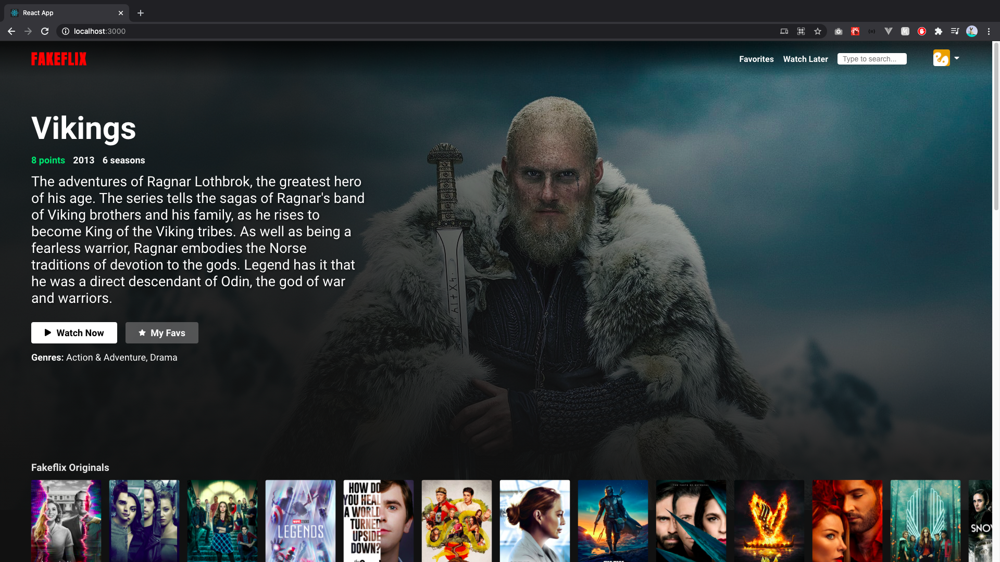
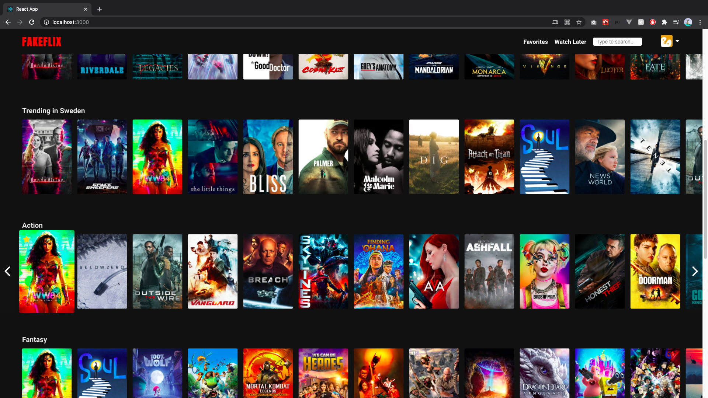

<h1 align="center">
# Fakeflix
</h1>

## Screenshot

<div style="display: flex; flex-direction: 'row'; align-items: 'center';">
   
   
</div>

## 📥 How to run

```bash
# Clone the project:
$ git clone https://github.com/rebecagrn/fakeflix.git

# Install the dependencies
$ yarn

# Run in browser
$ yarn start

```

# :rocket: Features

- Search movies
- Favorite movies
- Move to Watch later

## 💻 Technologies and libraries

<ul>
  <li>React</li>
  <li>React Hooks</li>
  <li>Styled Components</li>
  <li>React Icons</li>
  <li>React-Router-Dom</li>
  <li>TMDb API</li>
</ul>

### Deployed in Vercel

[Click Here](https://fakeflix-iota.vercel.app/)

**By ❤ : [Rebeca](https://rebecadeveloper.netlify.app/)**
